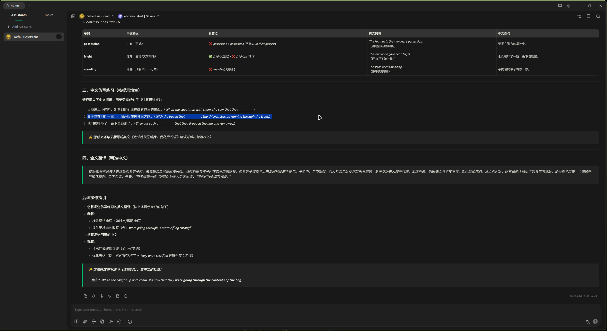

# Ollama

[Ollama官方网站](https://ollama.com/)

## 安装配置ollama


现在我的显卡是`nvidia-4060` 所以需要安装以下的内容。

```zsh
sudo pacman -S ollama ollama-cude
```

安装完成之后，就需要下载模型。这里可以直接使用`run` 命令即可

```zsh
ollama run qwen3-coder:30b
```

然后会下载文件，等待下载完成之后则可以直接使用了。

> [!IMPORTANT]
> 
> 本身`ollama` 用`pacman` 包管理进行管理时是不会自启动的，需要我们使用命令
> ```zsh
> ollama serve
> ```


## 如何创造一个特殊的角色

当模型下载完之后，使用`ollama create` 可以以一个模型为基础设置一个特殊的有自己个性的模型。
```txt
# 基本模型
FROM qwen3:30b

# 设定系统提示词（角色灵魂）
SYSTEM """
你是一个英语专家，我会给你发英语文章。
你会对这篇文章进行分析，分析其中的重点语法，语法树也需要列出来。
同时你也会分析这篇文章中的重点短语，重点单词，这两样你需要给出中英两种解释，还要给出例句。

然后针对这三个模块，语法、短语、单词给出相应的中文仿写练习（我会按照你的提示，给出英文翻译练习）。

最后把我发的这篇文章翻译成中文，我后面会过一段时间根据这段中文去做回译。然后我会把回译的内容发给你，需要你帮我去改出回译的错误，以及更好的表达方式。

后续我会把仿写练习发给你，你还需要对仿写中的错误进行纠正并给出更地道的写法。

"""

# 调节参数（可选，0.7-0.8 适合对话，1.0 以上更疯狂）
PARAMETER temperature 0.8
```

如上面的，通过上面的文本我可以设置一个*英语老师*为我所用。

```zsh
ollama create et-qwen -f et-qwen.txt

```

> [!IMPORTANT]
> 注意： 在`txt` 文件中，我们在第一句就已经指定了基础模型。


然后通过`ollama list` 可查看现在的模型列表。

```zsh
NAME               ID              SIZE      MODIFIED
et-qwen:latest     d29be0fa4bcd    18 GB     22 hours ago
qwen3:30b          ad815644918f    18 GB     22 hours ago
qwen3-coder:30b    06c1097efce0    18 GB     27 hours ago
llama3.2:latest    a80c4f17acd5    2.0 GB    40 hours ago

```


## 安装CherryStudio

```zsh
paru -S cherry-studio-bin
```


 


