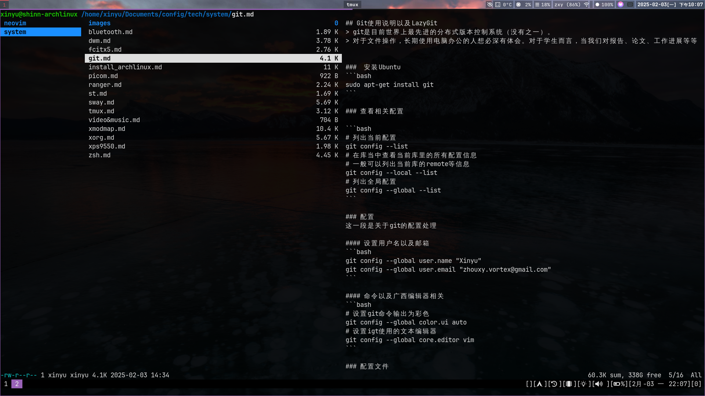

## Ranger的配置和使用

<!--ts-->
   * [Ranger的配置和使用](#ranger的配置和使用)
      * [安装](#安装)
      * [配置](#配置)
         * [更改主题](#更改主题)
         * [显示隐藏的文件](#显示隐藏的文件)
   * [图片预览工具](#图片预览工具)
<!--te-->



Ranger是一个命令行下的文件管理器，快捷也好用，这个文档主要是记录一下自己在使用过程中的配置过程。作为一个简单的笔记。

[ArchLinux ranger wiki](https://wiki.archlinux.org/title/Ranger) 可点击链接查看ArchLinux Wiki进行配置。

### 安装
```bash
sudo pacman -S ranger
```

| Key     | Command                                        |
|---------|------------------------------------------------|
| ?       | 打开用户说明书以及当前的设置和快捷键的绑定状态 |
| l,Enter | 打开文件                                       |
| j,k     | 上下选择当前目录下的文件                       |
| h,l     | 左右两个键是对现在文件夹的上下目录进行游览     |

### 配置
a我们当前的配置生成配置文件，这些配置文件会放置在`~/.config` 目录下。
```bash
ranger --copy-config=all
```

经过上面的配置之后，需要在环境变量中设置`RANGER_LOAD_DEFAULT_RC=false` 以防全局的设置污染当前的个人配置。 

更改`/etc/environment`添加上面讲的配置

|     File    |                           Spec                           |
|:-----------:|:--------------------------------------------------------:|
|   rc.conf   |            启动时加载的commands和key bindings            |
| commands.py |                    使用`:` 加载的命令                    |
|  rifle.conf | applications used when a given type of file is launched. |

#### 更改主题
在`~/.config/ranger/rc.conf`文件下面可以对下面的配置进行更改

```
# 设置主题为 jungle
set colorscheme jungle
```

#### 显示隐藏的文件
同样的还是对`~/.config/ranger/rc.conf`这个文件进行编辑

```
# 更改把隐藏的文件默认都显示出来
set show_hidden true
```

##  图片预览工具

[Github上关于预览工具](https://github.com/ranger/ranger/wiki/Image-Previews) 

```bash
sudo pacman -S w3m
```

这里是w3m，一个`terminal` 下的浏览器工具，文本式的。

然后在配置文件中要对预览给配置上。
> Add the line `set preview_images true` to your `~/.config/ranger/rc.conf`.

上面的配置在`foot` 下面并不成功。后面再去尝试开启更改这块内容吧。


