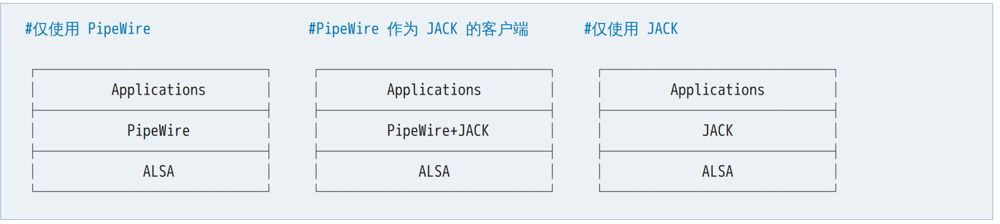

## 影音娱乐以及录屏

<!--ts-->
   * [影音娱乐以及录屏](#影音娱乐以及录屏)
      * [声音服务](#声音服务)
      * [mpv](#mpv)
      * [OBS](#obs)
      * [Music](#music)
<!--te-->

在ArchLinux下，如果我想去播放视频以及音乐的话，可以安装下面几个软件。


### 声音服务
[专业音频Wiki](https://wiki.archlinuxcn.org/wiki/%E4%B8%93%E4%B8%9A%E9%9F%B3%E9%A2%91)



在安装archlinux时我们已经安装了`alsa` 组件，可以驱动声卡等组件，不过功能还是不够丰富，比如切换`hdmi` 对声音进行输出时比较麻烦。所以这时候我们就需要使用`pipewire` 进行管理。

$$\left( \sum_{k=1}^n a_k b_k \right)^2 \leq \left( \sum_{k=1}^n a_k^2 \right) \left( \sum_{k=1}^n b_k^2 \right)$$

```zsh
$ sudo pacman -S pipewire-alsa
$ sudo pacman -S pipewire-pulse
```
安装这两个软件包，一个是alsa的安装包，一个是管理软件。

通过下面的命令可以查看当前的服务信息:
```zsh
$ pactl info
```

安装`pavucontrol`是一个图形化的控制界面，还是比较方便去控制音量的。

```zsh
$ sudo pacman -S pavucontrol
```

### mpv

这是一款可以播放Video的软件。使用下面的命令去安装。

```zsh
sudo pacman -S mpv
```

```zsh
sudo pacman -S yt-dlp

# 使用硬件加速播放bilibili在线视频
prime-run mpv --referrer="https://www.bilibili.com" -v --no-resume-playback --hwdec=auto --ytdl-raw-options=cookies-from-browser=chrome --start=13 video_url
```

### OBS

这是一款可以录屏和直播的软件

```zsh
sudo pacman -S obs-studio
```

### Music

[ArchLinux Studio娱乐影音的指导文章](https://archlinuxstudio.github.io/ArchLinuxTutorial/#/play&office/media)

[FeelUOwn](https://github.com/feeluown/FeelUOwn) 这款音乐播放器是`python` 编写的，与其他的一些软件播放器比较来看(electron)编写的，效率上要好一点，另外对于输入法一类的都还是不错的。

```zsh
# 安装FeelUOwn 音乐播放器
yay -S feeluown

# 安装网易云音乐插件
yay -S feeluown-netease
```


我们可以使用终端下的一个音乐播放器，`mpd` 和 `ncmpcpp`。
```zsh
sudo pacman -S ncmpcpp
sudo pacman -S mpd
```

mpd的配置文件在`~/.config/mpd/mpd.conf`

而ncmpcpp的配置文件在`~/.config/ncmpcpp/bindings` 这个文件是配置按键的快捷键的，`~/.config/ncmpcpp/config` 是ncmpcpp的配置文件。

安装完配置之后还需要建立`mpd` 的所需要的*playlist* 文件夹。

```zsh
mkdir -p ~/.config/mpd/playlists/
cd ~/.config/mpd
touch mpdstate
```

需要先启动`mpd` 之后才可以再启动`ncmpcpp` 程序。

进行`ncmcpp` 之后可以使用*1~9* 进行切换菜单。
