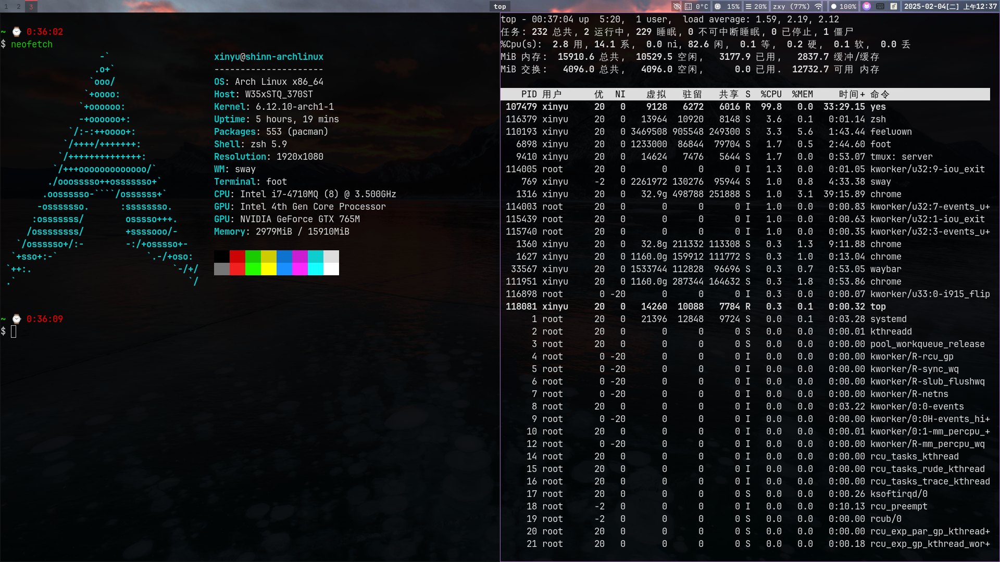
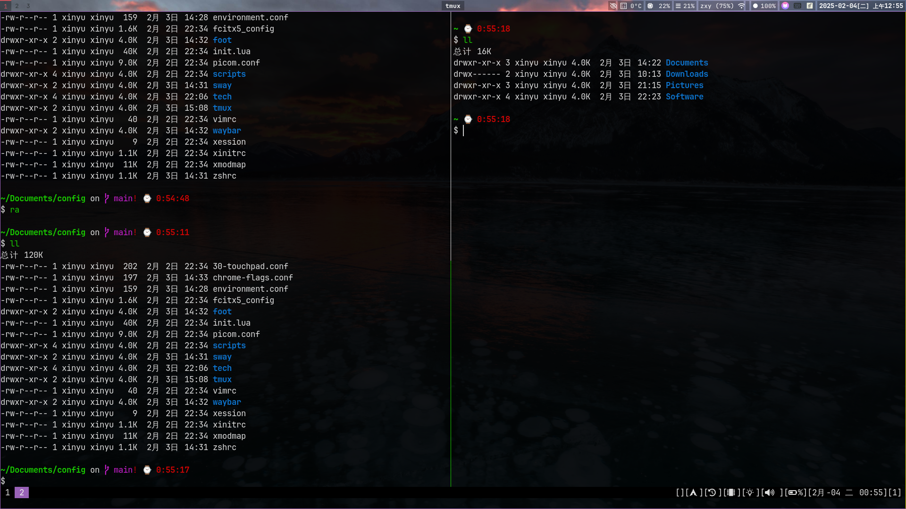

## Sway

<!--ts-->
   * [Sway](#sway)
      * [安装必备的包](#安装必备的包)
         * [安装基础包](#安装基础包)
         * [安装menu管理器](#安装menu管理器)
         * [安装模拟Terminal](#安装模拟terminal)
         * [安装StatusBar-&gt;waybar](#安装statusbar-waybar)
         * [安装XWayland](#安装xwayland)
      * [一些软件配置](#一些软件配置)
         * [按钮互换](#按钮互换)
         * [fcitx5](#fcitx5)
         * [Chrome](#chrome)
         * [截图等工具的使用](#截图等工具的使用)
         * [使用壁纸](#使用壁纸)
         * [使用消息管理器](#使用消息管理器)

<!--te-->



Sway是一个类似<b>[i3](https://i3wm.org/)</b>的平铺式窗口管理软件。他是运行在`Wayland` 环境下的，而`i3` 则是`xorg`下的*平铺窗口管理器*。

[Sway ArchLinux Wiki](https://wiki.archlinux.org/title/Sway) 在这个链接中也简单的列举了一些配置文件和如何使用。

### 安装必备的包

#### 安装基础包

```bash
sudo pacman -S sway
```

上面的命令使用`pacman` 安装了官方的安装源，版本跟`release` 是一样的，不过在`AUR` 中也有跟源码关联的安装库可以使用`yay` 进行安装。

```bash
yay -S sway-git
```

#### 安装menu管理器

在`dwm`中我们使用的是`dmenu` 这个菜单管理器，而在`sway` 中，也有类似的管理器，界面也几乎都相同。有两个选择，`sway` 中默认支持的是`wmenu`，而我们也可以使用`bemenu`等，官方推荐的*menu* 可以查看其github上的wiki说明。

我就选择了`wmenu`。
```bash
sudo pacman -S wmenu
```

#### 安装模拟Terminal

模拟终端使用是的开源项目<b>[foot](https://github.com/DanteAlighierin/foot)</b>，它是一个非常轻量小巧的运行在`wayland`中的`Terminal 终端模拟器`。

```bash
sudo pacman -S foot
```

其配置文件在`~/.config/foot/foot.ini`下。

#### 安装StatusBar->waybar



在默认的情况下，`swaybar` 是默认的状态栏显示器，不过比较丑，功能也比较少，那么我们可以使用`waybar`来显示。

```bash
sudo pacman -S waybar
```

其配置文件有两个:
1. `~/.config/waybar/config` 这是一个json文件，主要用于配置显示什么内容，格式等信息。
2. `~/.config/waybar/style.css` 这是一个`css` 文件，对于状态栏的样式进行控制，如：*使用什么样的字体*，*状态的透明度和颜色等信息*。

#### 安装XWayland

在使用的过程中，有一些软件是无法支持`wayland`的，比如`clash-verge-bin` 现在暂时我并没有找到`wayland` 支持的切换按钮。

那么就必须要使用`XWayland`，对`X11`的软件协议达到兼容的效果。

```bash
sudo pacman -S xorg-xwayland
```

这个安装包安装完成之后，使用`reboot` 命令重启之后生效。

### 一些软件配置

这里记录一下在`wayland` 中一些软件配置的问题。

#### 按钮互换
[如何交换左Super键和左Alt键](https://www.reddit.com/r/swaywm/comments/156wsoe/comment/jt3id0x/)，这篇文章跟官方的wiki有些不同的，查看多了解一下。

他的方案是`.config`目录下创建一个自己的配置文件`your_layout.xkb`然后在`~/.config/sway/config` 文件中加载这个配置，这种解决方案我感觉并不是很优雅。

在官方的wiki中给出了下面的方式

```conf
input type:keyboard {
    xkb_layout us
    xkb_variant ,nodeadkeys
    xkb_options altwin:swap_lalt_lwin,ctrl:swapcaps
}
```

更新配置到上述的配置，这个配置主要用于交换`caps_lock` 和`left_control` 以及`super_l` 和 `alt_l`。

[How to remaping the capslock and control, win and alt key.](https://www.reddit.com/r/swaywm/comments/1gtkjc9/remapping_esc_caps_and_ctrl/)

这个链接则是讲述了如何去交换右侧的`super_r` 和`alt_r`。

#### fcitx5

[The Blog about how to config fcitx5 in sway](https://cloud-atlas.readthedocs.io/zh-cn/latest/linux/desktop/chinese/fcitx_sway.html) 


```bash
sudo pacman -S fcitx5 fcitx5-chinese-addons fcitx5-material-color fcitx5-configtool
```

这里的安装包内容跟在`X11` 下基本没有区别。

set the `/etc/environment`
```conf
# XIM="fcitx"
GTK_IM_MODULE=fcitx
QT_IM_MODULE=fcitx
XMODIFIERS=@im=fcitx
INPUT_METHOD=fcitx
SDL_IM_MODULE=fcitx
GLFW_IM_MODULE=fcitx
```

区别在于需要增加一个`GLFW_IM_MODULE` 配置。

--------

在`X11` 下我们开机启动`fcitx5` 是在`~/.xinitrc` 下增加`fcitx5 -d` 以`daemon` 的形式启动。 

在`~/.config/sway/config`的配置文件内增加这一行。

```conf
exec_always --no-startup-id  fcitx5 -d
```

--------
经过测试之后发现在`Chrome` 中输入法并无法正确的使用。

需要在启动的时候增加`--wayland-text-input-version=3` 启动参数才能完整的使用`fcitx5`。其他的解决方案如`--gtk-version=4` 也无法在`Chrome` 启用`fcitx5`。

#### Chrome
**Chrome** 或者使用**Chromium** 内核的游览器默认启动是使用`X11` 的，需要启动添加参数方能以`Wayland` 的环境启动。

```bash
google-chrome-stable --ozone-platform=wayland --enable-features=ozone --enable-wayland-ime --disable-features=WaylandFractionalScaleV1 --gtk-version=3
```

在启动`google-chrome` 时添加启动参数，那么`chrome` 则可以正常启动。

每次输入参数比较麻烦，添加`~/.config/chrome-flags.conf` 文件。

在配置文件中配置每次启动时的参数。

```conf
--enable-features=UseOzonePlatform
--ozone-platform=wayland
--enable-features=WebRTCPipeWireCapturer
--disable-features=WaylandFractionalScaleV1
--enable-wayland-ime
# very important!!! otherwise the fcitx5 will not work
--wayland-text-input-version=3
```

#### 截图等工具的使用

[ArchLinux 对于截图的wiki文档](https://wiki.archlinux.org/title/Screen_capture)

```bash
sudo pacman -S extra/sway-contrib
```

然后再对`sway` 进行配置，配置对应的快捷键，再进行截图。 

```conf
# 使用Print键对整个区域进行截图
bindsym Print exec grim
```
其中我们可以使用`slurp` 来进行截图

```bash
# 对一个可选区域进行截图，这种方式会增加一个timestamp名称，并储存在 ~目录下
slurp | grim

# 对一个区域进行截图，指定名称并且存储在 ~/Pictures/ 下
slurp | grim -g - scrrenshot.png
```

```conf
bindsym $mod+Shift+p exec slurp | grim
```
上面的配置表示使用快捷键`Super+Shfit+p` 对一块区域进行截图操作。

#### 使用壁纸
需要使用到一个包`swaybg`

```bash
sudo pacman -S swaybg
```

然后在`~/.config/sway/config` 中添加下面的命令可以设置壁纸
```conf
output * background ~/Pictures/wallpapers/wallpaper1.jpg fill
```

#### 使用消息管理器

在`sway` 中当我们需要有一个消息通知的时候，可以使用`dunst` 这个包进行管理。

[Dunst Wiki](https://wiki.archlinux.org/title/Dunst)

```bash
# to install the dunst package
sudo pacman -S dunst
```

配置文件的位置在`~/.config/dunst/dunstrc` 


